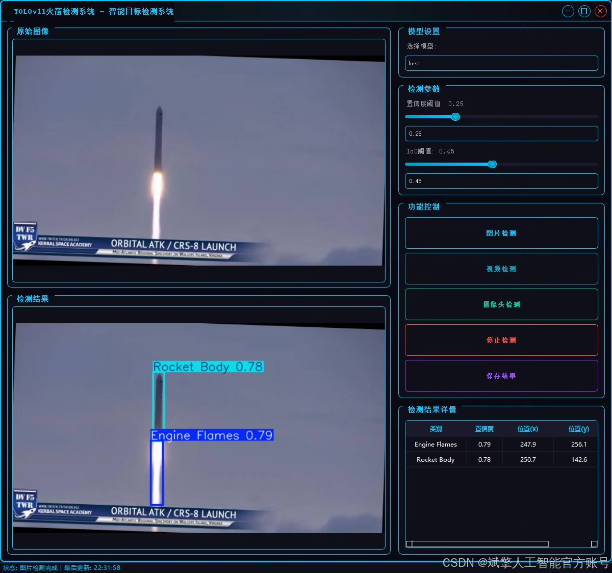
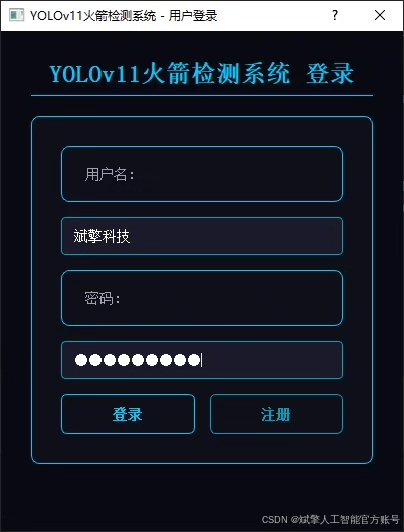
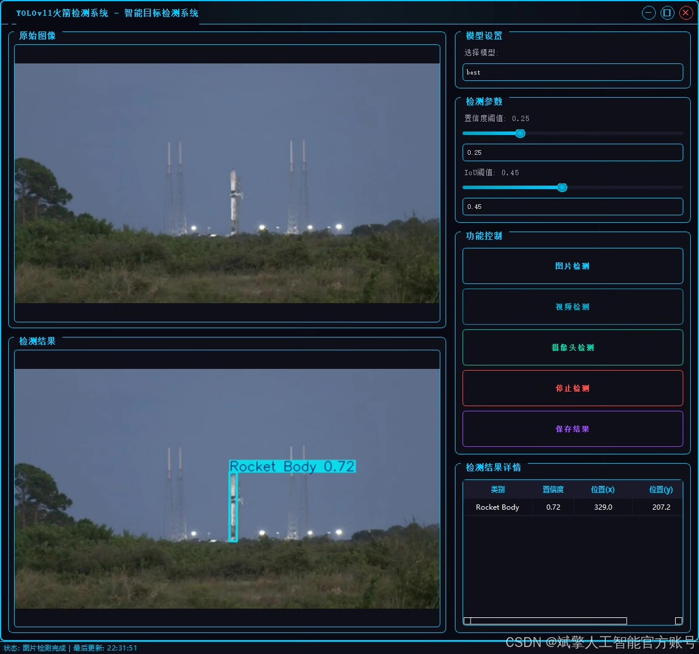
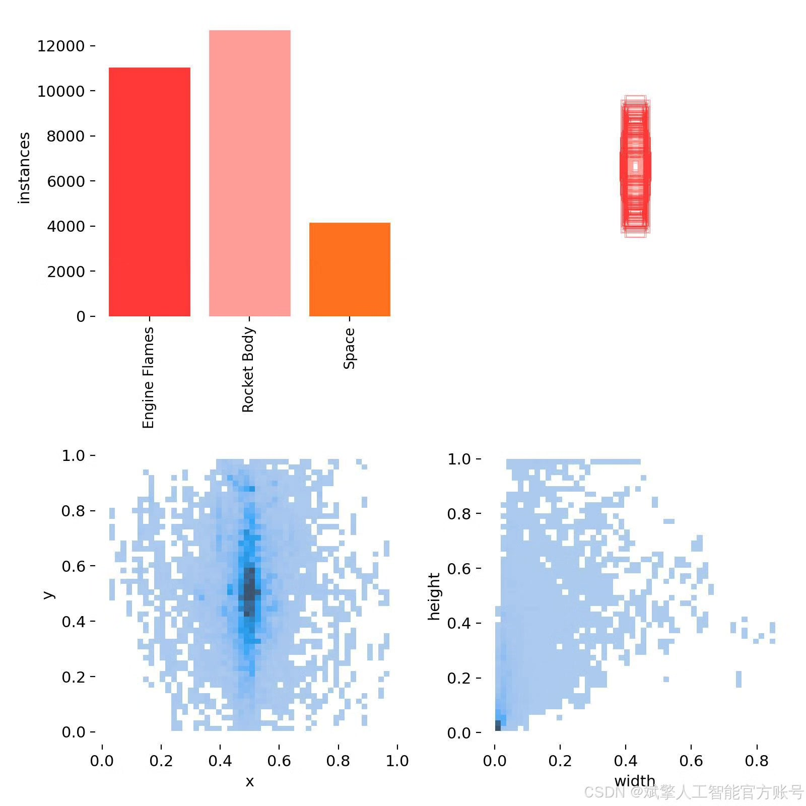
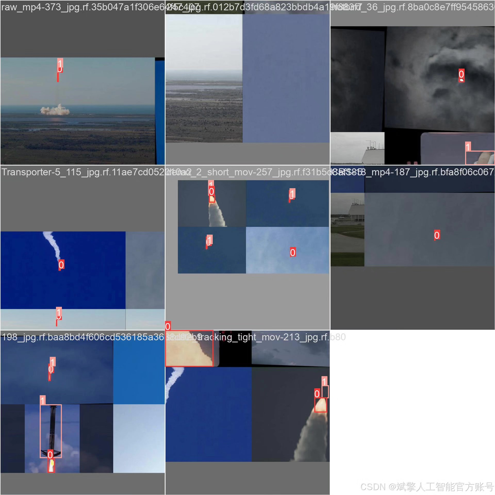
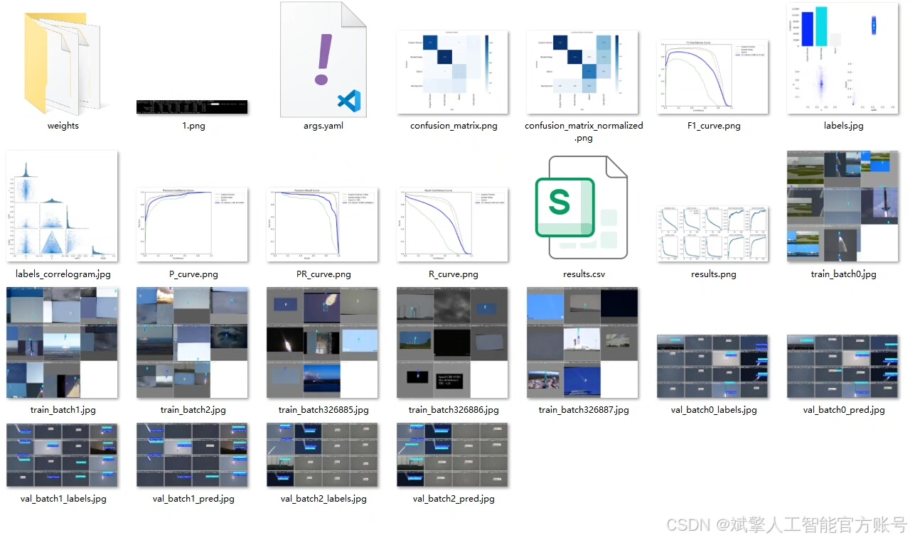
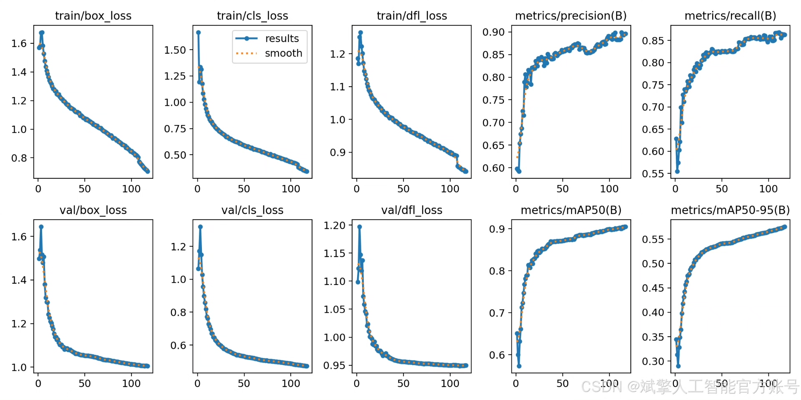
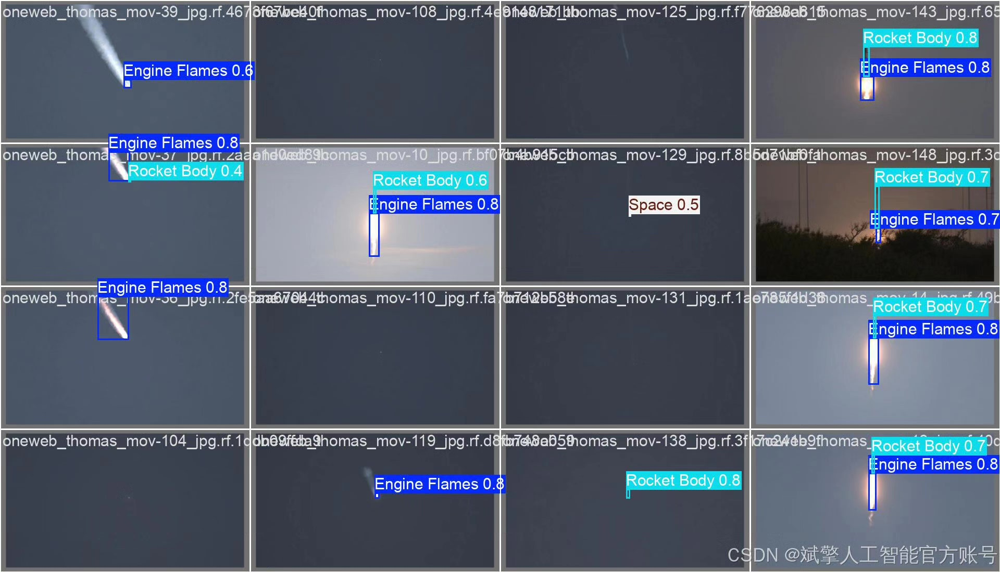

# YOLOv11 Rocket Detection System

## Body

YOLOv11 Rocket Detection System Based on Deep Learning YOLOv11's Rocket Recognition Detection System (YOLOv11+YOLO dataset + UI interface + login registration interface + Python project source code + model)

This project is based on the cutting-edge YOLOv11 object detection algorithm, developing a high-performance multi-part component detection system for rockets. The system can accurately identify and locate three key components of the rocket launch process: engine flames (Engine Flames), rocket body (Rocket Body), and Space. Through thorough training on a large-scale, high-quality custom dataset, the model exhibits excellent detection accuracy and robustness in complex and diverse scenarios, such as different lighting conditions, weather, rocket attitude, and launch phases. This system can be widely applied in real-time monitoring of space launches, automatic analysis of video materials, evaluation of aircraft status, and aerospace popular science education, providing automated visual perception technical support for aerospace activities.

Dataset:
nc: 3
names: ['Engine Flames', 'Rocket Body', 'Space'],
dataset quantity: training set 24435, validation set 2428, test set 1286

✅ User login registration: Supports password verification and security validation.
✅ Three detection modes: Based on the YOLOv11 model, supports image, video, and real-time camera detection, accurately identifying targets.
✅ Dual-screen comparison: Display original images and detection results on the same screen.
✅ Data visualization: Real-time table displaying the category, confidence, and coordinates of detected targets.
✅ Intelligent parameter adjustment: Offers a confidence slide bar to dynamically optimize detection accuracy, adapting to different scene needs.
✅ Sci-fi style interface: Dark theme combined with dynamic light effects, reducing visual fatigue and improving operational experience.

## Images

## Payment

Here is a pay link on Stripe ( https://buy.stripe.com/3cs8yP7sY87d0vu9AB ). Please contact me lonlonago@foxmail.com after funding $89, and I will send you a complete data files , thank you!

